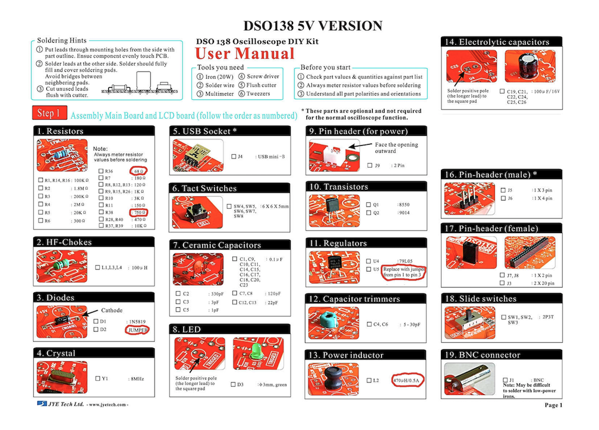
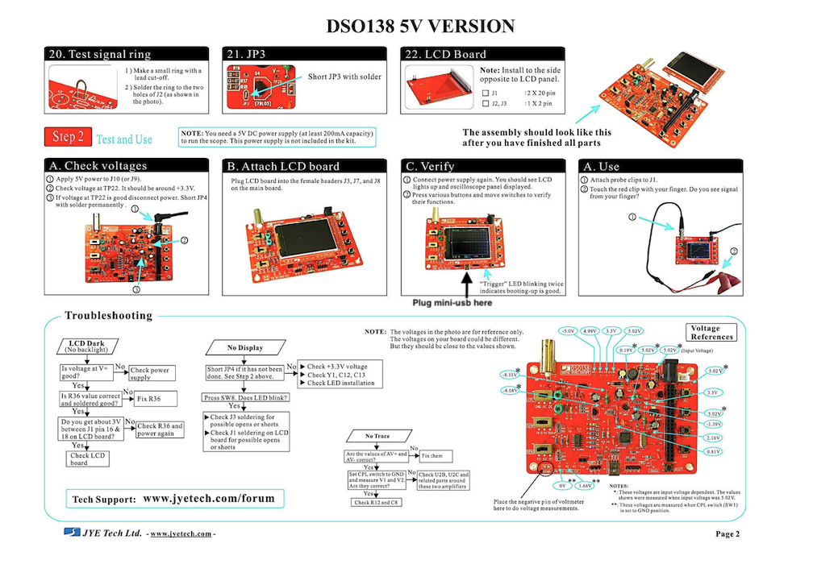
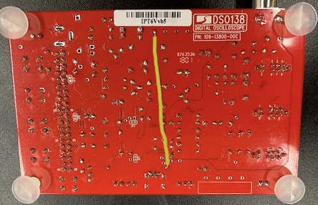
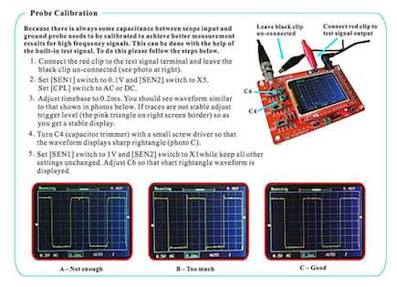
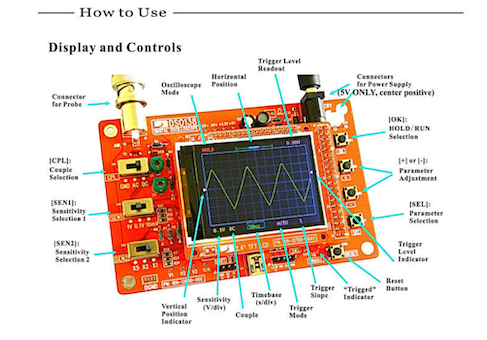

# Oscilloscope
_______________________________________________________________________________

In this project, you will be soldering your own oscilloscope using a Kit provided to you in lab.

### Before You Start 

There are a couple changes that we are making in order to USB power our circuit, so when you open the kit, you should do the following things:

1. Lay out and measure all of the resistors using a multimeter and make sure you have:
    * 3 of the 100 KOhm, 120 Ohm, 1 KOhm
    * 2 of the 180 Ohm, 470 Ohm, 10 KOhm
    * 1 of the 1.8 MOhm, 200 KOhm, 2 MOhm, 20 KOhm, 300 Ohm, 3 KOhm, 150 Ohm, 1.5 KOhm
2. Now, you will need to acquire a 68Ohm resistor (this will replace one of the 180 Ohm resistors) and a 750Ohm resistor (this will replace the 1.5 KOhm resistor). If you can't acquire these values, you can make them with parallel/series combinations. Follow [this link](https://www.qsl.net/in3otd/parallr.html) for help with figuring out a combination.
3. You will also need a 470mH inductor (this will replace the power inductor in your kit)
4. The next step is to follow the *modified* instructions given in your kit. 

*Please note that you will be replacing a couple resistors, a regulator, a diode, and an inductor so some of the parts given to you in your kit will remain unused.*

Complete all assembly instructions through #22 before pausing and going on to Step 2: testing.

Finally, attach the nylon feet to the back of the board. This will prevent any unwanted changes to the signal due to the back of the board touching the table. 

### Testing

Connect power to J9 or J10 via a power supply before you start Step 2. If you're unsure how to do this, use a power supply unit and connect the red prong to the positive terminal and the black prong to the negative terminal (or to ground if that's easier to access). For J9, the positive and negative terminals are labeled; for J10, the positive terminal is the terminal closest to the top edge of the board and the negative terminal is the parallel one across from it.

Make sure the CPL switch is set to either AC or DC (NOT GND).

### Wiring to Power

In order to power our oscilloscope via USB, we can solder a single wire from the VBus pin next to the to the positive terminal of usb port to the +5V pin at the top. Use the image below as a reference.

### Final Test

Now that you're a little more confident, try to follow the probe calibration step below. 

For additional help please reference the image below.

Now you're ready to go on and make a function generator! 

## License

[SMIrC Lab](http://smirc.stanford.edu)

